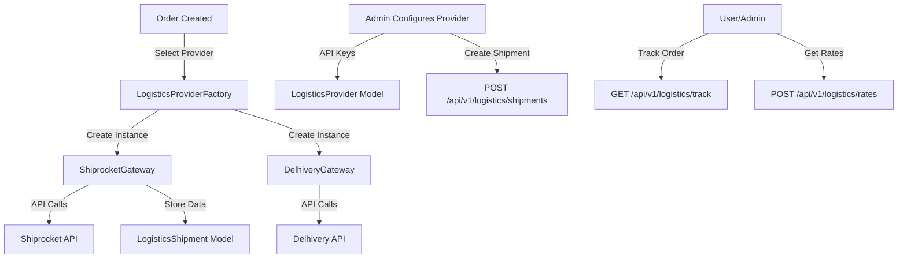

# Logistics API Reference

This document provides comprehensive documentation for the multi-provider logistics integration system, including all endpoints, request/response schemas, provider configurations, and best practices.

**Base URL**: `http://localhost:3000/api/v1` (or your production URL)

**Authentication**: Most endpoints require a Bearer token in the Authorization header:
```
Authorization: Bearer <jwt_token>
```

---

## Table of Contents

1. [Introduction](#introduction)
2. [Admin Logistics Provider Management](#admin-logistics-provider-management)
3. [Logistics Operations](#logistics-operations)
4. [Provider-Specific Configuration](#provider-specific-configuration)
5. [Request/Response Examples](#requestresponse-examples)
6. [Webhooks](#webhooks)
7. [Best Practices](#best-practices)
8. [Troubleshooting](#troubleshooting)

---

## Introduction

### Overview

The multi-provider logistics integration system allows you to integrate with multiple logistics providers (Shiprocket, Delhivery, ClickPost, etc.) through a unified API. This system provides:

- **Unified Interface**: Single API works with any configured provider
- **Provider Management**: Admin can configure multiple providers via API
- **Automatic Selection**: System automatically selects best provider based on requirements
- **Rate Comparison**: Compare rates across multiple providers
- **Scalable Architecture**: Easy to add new providers without code changes

### Supported Providers

Currently implemented:
- **Shiprocket** - One of India's most widely used logistics aggregators

Planned (framework ready):
- **Delhivery** - Direct courier API with PAN-India coverage
- **ClickPost** - Multi-carrier logistics API aggregator
- **Vamaship** - Logistics aggregator
- **Shipjee** - Marketplace/Shipping API
- **IndiSpeed** - ONDC-native shipping platform
- **ULIP** - Government unified logistics interface

### Architecture Overview



---

## Admin Logistics Provider Management

Admin endpoints for managing logistics provider configurations. All endpoints require Admin authentication.

### POST /api/v1/admin/logistics-providers

Create logistics provider

Create and configure a new logistics provider (Shiprocket, Delhivery, etc.)

**Permissions**: Admin (Bearer token required)

**Request Body:**
```json
{
  "name": "Shiprocket",
  "type": "SHIPROCKET",
  "config": {
    "email": "merchant@example.com",
    "password": "password123",
    "apiKey": "API_KEY",
    "environment": "production"
  },
  "webhookUrl": "https://api.example.com/webhooks/logistics",
  "webhookSecret": "webhook_secret",
  "supportedRegions": ["IN", "US"],
  "supportedServices": ["express", "standard", "cod"],
  "isActive": true,
  "isDefault": false,
  "priority": 0
}
```

**Request Body Fields:**
- `name` (string, **required**): Display name of the logistics provider
- `type` (string, **required**): Provider type - `SHIPROCKET`, `DELHIVERY`, `CLICKPOST`, `VAMASHIP`, `SHIPJEE`, `INDISPEED`, `ULIP`
- `config` (object, **required**): Provider-specific configuration (see [Provider-Specific Configuration](#provider-specific-configuration))
- `webhookUrl` (string, optional): Webhook URL for status updates
- `webhookSecret` (string, optional): Webhook secret for signature verification
- `supportedRegions` (array, optional): Supported regions/countries (e.g., `["IN", "US"]`)
- `supportedServices` (array, optional): Supported service types (e.g., `["express", "standard", "cod"]`)
- `isActive` (boolean, optional): Whether the provider is active (default: `false`)
- `isDefault` (boolean, optional): Whether this is the default provider (default: `false`)
- `priority` (integer, optional): Provider priority for selection (lower = higher priority, default: `0`)

**Response (201 Created):**
```json
{
  "success": true,
  "data": {
    "id": "log_prov_123",
    "name": "Shiprocket",
    "type": "SHIPROCKET",
    "isActive": true,
    "isDefault": false,
    "config": {
      "email": "merchant@example.com",
      "password": "***d123",
      "apiKey": "***KEY",
      "environment": "production"
    },
    "supportedRegions": ["IN", "US"],
    "supportedServices": ["express", "standard", "cod"],
    "priority": 0,
    "createdAt": "2026-01-10T08:00:00.000Z",
    "updatedAt": "2026-01-10T08:00:00.000Z"
  },
  "message": "Logistics provider created successfully"
}
```

**Error Responses:**

**400 Bad Request** - Validation error or provider already exists
```json
{
  "success": false,
  "error": "Logistics provider with type SHIPROCKET already exists"
}
```

**401 Unauthorized** - No token provided or invalid token
```json
{
  "success": false,
  "error": "No token, authorization denied"
}
```

**403 Forbidden** - Admin access required
```json
{
  "success": false,
  "error": "Forbidden - Admin access required"
}
```

---

### GET /api/v1/admin/logistics-providers

Get all logistics providers

Retrieve paginated list of all logistics providers with optional filters

**Permissions**: Admin (Bearer token required)

**Query Parameters:**
- `isActive` (boolean, optional): Filter by active status
- `type` (string, optional): Filter by provider type
- `page` (integer, optional): Page number (default: `1`)
- `limit` (integer, optional): Items per page (default: `20`)

**Response (200 OK):**

Each provider includes `incomingWebhookUrl` when the backend has a webhook endpoint for that type (e.g. Shiprocket). Use this URL in the provider dashboard as the webhook URL for tracking updates; otherwise the field is `null`.

```json
{
  "success": true,
  "data": [
    {
      "id": "log_prov_123",
      "name": "Shiprocket",
      "type": "SHIPROCKET",
      "isActive": true,
      "isDefault": true,
      "config": {
        "email": "merchant@example.com",
        "password": "***d123",
        "apiKey": "***KEY",
        "environment": "production"
      },
      "supportedRegions": ["IN", "US"],
      "supportedServices": ["express", "standard", "cod"],
      "priority": 0,
      "incomingWebhookUrl": "https://api.example.com/api/v1/webhooks/logistics/shiprocket",
      "createdAt": "2026-01-10T08:00:00.000Z",
      "updatedAt": "2026-01-10T08:00:00.000Z"
    }
  ],
  "pagination": {
    "page": 1,
    "limit": 20,
    "total": 1,
    "pages": 1
  }
}
```

---

### GET /api/v1/admin/logistics-providers/:id

Get logistics provider by ID

Retrieve details of a specific logistics provider

**Permissions**: Admin (Bearer token required)

**Path Parameters:**
- `id` (string, required): Logistics provider ID

**Response (200 OK):**

The provider includes `incomingWebhookUrl` when the backend has a webhook endpoint for that type. Use this URL in the provider dashboard (e.g. Shiprocket) as the webhook URL for tracking updates; otherwise the field is `null`.

```json
{
  "success": true,
  "data": {
    "id": "log_prov_123",
    "name": "Shiprocket",
    "type": "SHIPROCKET",
    "isActive": true,
    "isDefault": true,
    "config": {
      "email": "merchant@example.com",
      "password": "***d123",
      "apiKey": "***KEY",
      "environment": "production"
    },
    "supportedRegions": ["IN", "US"],
    "supportedServices": ["express", "standard", "cod"],
    "priority": 0,
    "incomingWebhookUrl": "https://api.example.com/api/v1/webhooks/logistics/shiprocket",
    "createdAt": "2026-01-10T08:00:00.000Z",
    "updatedAt": "2026-01-10T08:00:00.000Z"
  }
}
```

**Error Responses:**

**404 Not Found** - Logistics provider not found
```json
{
  "success": false,
  "error": "Logistics provider not found"
}
```

---

### PUT /api/v1/admin/logistics-providers/:id

Update logistics provider

Update configuration of an existing logistics provider

**Permissions**: Admin (Bearer token required)

**Path Parameters:**
- `id` (string, required): Logistics provider ID

**Request Body:**
```json
{
  "name": "Shiprocket Updated",
  "config": {
    "email": "newemail@example.com",
    "password": "newpassword",
    "apiKey": "NEW_API_KEY",
    "environment": "production"
  },
  "isActive": true,
  "isDefault": true,
  "priority": 1
}
```

**Response (200 OK):**
```json
{
  "success": true,
  "data": {
    "id": "log_prov_123",
    "name": "Shiprocket Updated",
    "type": "SHIPROCKET",
    "isActive": true,
    "isDefault": true,
    "config": {
      "email": "newemail@example.com",
      "password": "***word",
      "apiKey": "***_KEY",
      "environment": "production"
    },
    "updatedAt": "2026-01-10T09:00:00.000Z"
  },
  "message": "Logistics provider updated successfully"
}
```

---

### PATCH /api/v1/admin/logistics-providers/:id/toggle

Toggle logistics provider active status

Enable or disable a logistics provider

**Permissions**: Admin (Bearer token required)

**Path Parameters:**
- `id` (string, required): Logistics provider ID

**Response (200 OK):**
```json
{
  "success": true,
  "data": {
    "id": "log_prov_123",
    "isActive": false,
    "updatedAt": "2026-01-10T09:00:00.000Z"
  },
  "message": "Logistics provider deactivated successfully"
}
```

---

### PATCH /api/v1/admin/logistics-providers/:id/set-default

Set default logistics provider

Set a logistics provider as the default provider

**Permissions**: Admin (Bearer token required)

**Path Parameters:**
- `id` (string, required): Logistics provider ID

**Response (200 OK):**
```json
{
  "success": true,
  "data": {
    "id": "log_prov_123",
    "isDefault": true,
    "updatedAt": "2026-01-10T09:00:00.000Z"
  },
  "message": "Default logistics provider set successfully"
}
```

**Error Responses:**

**400 Bad Request** - Cannot set inactive provider as default
```json
{
  "success": false,
  "error": "Cannot set inactive provider as default"
}
```

---

### DELETE /api/v1/admin/logistics-providers/:id

Delete logistics provider

Delete a logistics provider (only if no active shipments)

**Permissions**: Admin (Bearer token required)

**Path Parameters:**
- `id` (string, required): Logistics provider ID

**Response (200 OK):**
```json
{
  "success": true,
  "message": "Logistics provider deleted successfully"
}
```

**Error Responses:**

**400 Bad Request** - Cannot delete provider with active shipments
```json
{
  "success": false,
  "error": "Cannot delete provider with 5 active shipments. Please cancel or complete shipments first."
}
```

---

## Logistics Operations

Public/authenticated endpoints for logistics operations including tracking, rate calculation, shipment creation, and management.

### GET /api/v1/logistics/track

Track shipment

Track a shipment by order ID or tracking number

**Permissions**: Authenticated (Bearer token required)

**Query Parameters:**
- `orderId` (string, optional): Order ID
- `trackingNumber` (string, optional): Tracking number or AWB
- `providerType` (string, optional): Provider type (auto-detected if not provided)

**Response (200 OK):**
```json
{
  "success": true,
  "data": {
    "trackingNumber": "AWB123456",
    "status": "in_transit",
    "providerStatus": "Out for Delivery",
    "events": [
      {
        "timestamp": "2026-01-10T10:00:00Z",
        "location": "Mumbai",
        "status": "in_transit",
        "description": "Package in transit"
      },
      {
        "timestamp": "2026-01-10T08:00:00Z",
        "location": "Mumbai Warehouse",
        "status": "picked_up",
        "description": "Picked up from warehouse"
      }
    ],
    "estimatedDelivery": "2026-01-12T18:00:00Z",
    "currentLocation": {
      "city": "Mumbai",
      "state": "Maharashtra",
      "pincode": "400001"
    }
  }
}
```

**Error Responses:**

**400 Bad Request** - Missing orderId or trackingNumber
```json
{
  "success": false,
  "error": "Either orderId or trackingNumber is required"
}
```

**404 Not Found** - Shipment not found
```json
{
  "success": false,
  "error": "Shipment not found"
}
```

---

### POST /api/v1/logistics/rates

Calculate shipping rates

Calculate shipping rates for a shipment. Set `compareAll=true` to compare rates across all providers.

**Permissions**: Authenticated (Bearer token required)

**Query Parameters:**
- `compareAll` (boolean, optional): Compare rates from all active providers (default: `false`)
- `providerType` (string, optional): Specific provider type to use

**Request Body:**
```json
{
  "pickup": {
    "pincode": "400001",
    "city": "Mumbai",
    "state": "Maharashtra"
  },
  "delivery": {
    "pincode": "110001",
    "city": "New Delhi",
    "state": "Delhi"
  },
  "weight": 1.5,
  "dimensions": {
    "length": 20,
    "width": 15,
    "height": 10
  },
  "codAmount": 1000
}
```

**Request Body Fields:**
- `pickup` (object, required): Pickup address details
  - `pincode` (string, required): Pickup pincode
  - `city` (string, optional): Pickup city
  - `state` (string, optional): Pickup state
- `delivery` (object, required): Delivery address details
  - `pincode` (string, required): Delivery pincode
  - `city` (string, optional): Delivery city
  - `state` (string, optional): Delivery state
- `weight` (number, required): Weight in kg
- `dimensions` (object, optional): Dimensions in cm
  - `length` (number): Length in cm
  - `width` (number): Width in cm
  - `height` (number): Height in cm
- `codAmount` (number, optional): COD amount if applicable

**Response (200 OK) - Single Provider:**
```json
{
  "success": true,
  "data": [
    {
      "provider": "SHIPROCKET",
      "courierCompanyId": 1,
      "courierName": "Express",
      "rate": 150.00,
      "estimatedDays": 2,
      "codAvailable": true
    },
    {
      "provider": "SHIPROCKET",
      "courierCompanyId": 2,
      "courierName": "Standard",
      "rate": 100.00,
      "estimatedDays": 4,
      "codAvailable": true
    }
  ]
}
```

**Response (200 OK) - Compare All Providers:**
```json
{
  "success": true,
  "data": {
    "comparisons": [
      {
        "provider": "SHIPROCKET",
        "providerName": "Shiprocket",
        "rates": [
          {
            "provider": "SHIPROCKET",
            "courierName": "Express",
            "rate": 150.00,
            "estimatedDays": 2
          }
        ]
      },
      {
        "provider": "DELHIVERY",
        "providerName": "Delhivery",
        "rates": [
          {
            "provider": "DELHIVERY",
            "courierName": "Express",
            "rate": 140.00,
            "estimatedDays": 2
          }
        ]
      }
    ],
    "errors": []
  }
}
```

---

### POST /api/v1/logistics/shipments

Create shipment

Create a new shipment for an order

**Permissions**: Admin/Vendor (Bearer token required)

**Query Parameters:**
- `providerId` (string, optional): Specific provider ID (uses default if not provided)

**Request Body:**
```json
{
  "orderId": "order_123",
  "pickup": {
    "name": "Warehouse",
    "address": "123 Warehouse St",
    "city": "Mumbai",
    "state": "Maharashtra",
    "pincode": "400001",
    "phone": "+919876543210"
  },
  "delivery": {
    "name": "John Doe",
    "address": "456 Customer St",
    "city": "New Delhi",
    "state": "Delhi",
    "pincode": "110001",
    "phone": "+919876543211"
  },
  "weight": 1.5,
  "dimensions": {
    "length": 20,
    "width": 15,
    "height": 10
  },
  "codAmount": 1000,
  "paymentMethod": "COD"
}
```

**Response (201 Created):**
```json
{
  "success": true,
  "data": {
    "id": "shipment_123",
    "orderId": "order_123",
    "providerId": "log_prov_123",
    "providerShipmentId": "SR123456",
    "awbNumber": "AWB123456",
    "trackingNumber": "AWB123456",
    "status": "created",
    "providerStatus": "NEW",
    "rate": 150.00,
    "labelUrl": "https://example.com/labels/AWB123456.pdf",
    "createdAt": "2026-01-10T08:00:00.000Z"
  },
  "message": "Shipment created successfully"
}
```

**Error Responses:**

**400 Bad Request** - Validation error
```json
{
  "success": false,
  "error": "orderId is required"
}
```

**403 Forbidden** - Admin/Vendor access required
```json
{
  "success": false,
  "error": "Forbidden - Admin/Vendor access required"
}
```

---

### GET /api/v1/logistics/shipments/:orderId

Get shipment status

Get shipment status for an order

**Permissions**: Authenticated (Bearer token required)

**Path Parameters:**
- `orderId` (string, required): Order ID

**Response (200 OK):**
```json
{
  "success": true,
  "data": [
    {
      "id": "shipment_123",
      "orderId": "order_123",
      "providerId": "log_prov_123",
      "awbNumber": "AWB123456",
      "trackingNumber": "AWB123456",
      "status": "in_transit",
      "providerStatus": "IN_TRANSIT",
      "rate": 150.00,
      "labelUrl": "https://example.com/labels/AWB123456.pdf",
      "estimatedDelivery": "2026-01-12T18:00:00.000Z",
      "createdAt": "2026-01-10T08:00:00.000Z",
      "updatedAt": "2026-01-10T10:00:00.000Z"
    }
  ]
}
```

**Error Responses:**

**404 Not Found** - No shipments found
```json
{
  "success": false,
  "error": "No shipments found for this order"
}
```

---

### POST /api/v1/logistics/shipments/:shipmentId/label

Generate shipping label

Generate shipping label for a shipment

**Permissions**: Admin/Vendor (Bearer token required)

**Path Parameters:**
- `shipmentId` (string, required): Shipment ID

**Response (200 OK):**
```json
{
  "success": true,
  "data": {
    "labelUrl": "https://example.com/labels/AWB123456.pdf",
    "awbNumber": "AWB123456"
  },
  "message": "Label generated successfully"
}
```

---

### POST /api/v1/logistics/shipments/:shipmentId/pickup

Schedule pickup

Schedule a pickup for a shipment

**Permissions**: Admin/Vendor (Bearer token required)

**Path Parameters:**
- `shipmentId` (string, required): Shipment ID

**Request Body:**
```json
{
  "pickupDate": "2026-01-11",
  "pickupTime": "10:00-17:00"
}
```

**Request Body Fields:**
- `pickupDate` (string, required): Pickup date in YYYY-MM-DD format
- `pickupTime` (string, optional): Pickup time window (e.g., "10:00-17:00")

**Response (200 OK):**
```json
{
  "success": true,
  "data": {
    "success": true,
    "pickupDate": "2026-01-11"
  },
  "message": "Pickup scheduled successfully"
}
```

---

### DELETE /api/v1/logistics/shipments/:shipmentId

Cancel shipment

Cancel a shipment

**Permissions**: Admin/Vendor (Bearer token required)

**Path Parameters:**
- `shipmentId` (string, required): Shipment ID

**Request Body:**
```json
{
  "reason": "Order cancelled by customer"
}
```

**Request Body Fields:**
- `reason` (string, optional): Cancellation reason

**Response (200 OK):**
```json
{
  "success": true,
  "data": {
    "id": "shipment_123",
    "status": "cancelled",
    "providerStatus": "CANCELLED"
  },
  "message": "Shipment cancelled successfully"
}
```

**Error Responses:**

**400 Bad Request** - Cannot cancel shipment
```json
{
  "success": false,
  "error": "Cannot cancel shipment with status: delivered"
}
```

---

### POST /api/v1/logistics/returns

Handle return shipment

Create a return shipment for an order

**Permissions**: Authenticated (Bearer token required)

**Request Body:**
```json
{
  "orderId": "order_123",
  "providerId": "log_prov_123",
  "pickup": {
    "name": "John Doe",
    "address": "456 Customer St",
    "city": "New Delhi",
    "state": "Delhi",
    "pincode": "110001",
    "phone": "+919876543211"
  },
  "delivery": {
    "name": "Warehouse",
    "address": "123 Warehouse St",
    "city": "Mumbai",
    "state": "Maharashtra",
    "pincode": "400001",
    "phone": "+919876543210"
  },
  "items": [
    {
      "name": "Product Name",
      "sku": "SKU123",
      "quantity": 1,
      "price": 1000
    }
  ],
  "total": 1000
}
```

**Response (201 Created):**
```json
{
  "success": true,
  "data": {
    "id": "SR789012",
    "awbNumber": "AWB789012",
    "trackingNumber": "AWB789012"
  },
  "message": "Return shipment created successfully"
}
```

---

## Provider-Specific Configuration

### Shiprocket Configuration

**Required Fields:**
- `email` (string): Shiprocket account email
- `password` (string): Shiprocket account password
- `apiKey` (string): Shiprocket API key
- `environment` (string): `"production"` or `"sandbox"`

**Example Configuration:**
```json
{
  "email": "merchant@example.com",
  "password": "password123",
  "apiKey": "YOUR_API_KEY",
  "environment": "production"
}
```

**API Documentation**: https://apidocs.shiprocket.in

### Delhivery Configuration (When Implemented)

**Required Fields:**
- `clientId` (string): Delhivery client ID
- `clientSecret` (string): Delhivery client secret
- `apiKey` (string): Delhivery API key
- `environment` (string): `"production"` or `"sandbox"`

**Example Configuration:**
```json
{
  "clientId": "YOUR_CLIENT_ID",
  "clientSecret": "YOUR_CLIENT_SECRET",
  "apiKey": "YOUR_API_KEY",
  "environment": "production"
}
```

### ClickPost Configuration (When Implemented)

**Required Fields:**
- `apiKey` (string): ClickPost API key
- `secretKey` (string): ClickPost secret key
- `environment` (string): `"production"` or `"sandbox"`

**Example Configuration:**
```json
{
  "apiKey": "YOUR_API_KEY",
  "secretKey": "YOUR_SECRET_KEY",
  "environment": "production"
}
```

---

## Request/Response Examples

### Complete Shipment Creation Flow

**Step 1: Calculate Rates**
```bash
POST /api/v1/logistics/rates?compareAll=true
Authorization: Bearer <token>

{
  "pickup": {
    "pincode": "400001",
    "city": "Mumbai",
    "state": "Maharashtra"
  },
  "delivery": {
    "pincode": "110001",
    "city": "New Delhi",
    "state": "Delhi"
  },
  "weight": 1.5,
  "dimensions": {
    "length": 20,
    "width": 15,
    "height": 10
  },
  "codAmount": 1000
}
```

**Step 2: Create Shipment**
```bash
POST /api/v1/logistics/shipments?providerId=log_prov_123
Authorization: Bearer <admin_token>

{
  "orderId": "order_123",
  "weight": 1.5,
  "dimensions": {
    "length": 20,
    "width": 15,
    "height": 10
  },
  "codAmount": 1000
}
```

**Step 3: Generate Label**
```bash
POST /api/v1/logistics/shipments/shipment_123/label
Authorization: Bearer <admin_token>
```

**Step 4: Schedule Pickup**
```bash
POST /api/v1/logistics/shipments/shipment_123/pickup
Authorization: Bearer <admin_token>

{
  "pickupDate": "2026-01-11",
  "pickupTime": "10:00-17:00"
}
```

**Step 5: Track Shipment**
```bash
GET /api/v1/logistics/track?trackingNumber=AWB123456
Authorization: Bearer <token>
```

---

## Webhooks

### POST /api/v1/webhooks/logistics/shiprocket

Shiprocket tracking webhook. Called by Shiprocket when tracking status changes. The backend finds the shipment by AWB, `sr_order_id`, or `order_id`, maps status to a normalized value, and updates `LogisticsShipment` (status, providerStatus, metadata, and actualDelivery when delivered). The endpoint always returns `200` with `{ "received": true }` so Shiprocket does not retry.

**Method:** `POST`  
**URL:** `https://your-api.com/api/v1/webhooks/logistics/shiprocket`

**Headers (optional):**
- `anx-api-key` – When the active Shiprocket logistics provider has `webhookSecret` set, Shiprocket (or your proxy) should send this header with the same value. On mismatch the backend only logs a warning and still processes the payload.

**Request body (JSON):** Shiprocket sends fields such as:
- `awb` (string) – AWB number
- `order_id` (string) – Your order number or ID
- `sr_order_id` (number) – Shiprocket order ID
- `current_status` (string) – e.g. DELIVERED, IN TRANSIT
- `shipment_status` (string) – Status from provider
- `scans` (array) – Scan history
- `current_timestamp` (string) – e.g. `"DD MM YYYY HH:mm:ss"`
- `etd` (string) – Estimated delivery
- `courier_name` (string) – Courier name

**Response:** Always `200 OK`
```json
{
  "received": true
}
```

**Signature verification:** If the active Shiprocket provider has `webhookSecret` configured, compare it to the `anx-api-key` header. On mismatch the backend logs a warning but still processes the webhook and returns 200.

---

## Best Practices

### Provider Selection Guidelines

1. **Set Default Provider**: Always set a default provider for automatic selection
2. **Priority Ordering**: Use priority field to control provider selection order
3. **Region Support**: Configure `supportedRegions` to match your shipping zones
4. **Service Types**: Configure `supportedServices` based on your needs (COD, express, etc.)

### Rate Comparison Strategies

1. **Compare All**: Use `compareAll=true` to get rates from all providers
2. **Filter by Service**: Filter results by service type (express, standard)
3. **Consider Delivery Time**: Balance cost vs delivery time
4. **COD Availability**: Check `codAvailable` flag for COD orders

### Error Handling Patterns

1. **Retry Logic**: Implement retry for transient failures
2. **Fallback Providers**: Use fallback chain if primary provider fails
3. **Error Logging**: Log all provider errors for debugging
4. **User-Friendly Messages**: Map provider errors to user-friendly messages

### Retry Logic

```javascript
// Example retry logic
async function createShipmentWithRetry(orderId, maxRetries = 3) {
  for (let i = 0; i < maxRetries; i++) {
    try {
      return await LogisticsService.createShipment(orderId);
    } catch (error) {
      if (i === maxRetries - 1) throw error;
      await sleep(1000 * (i + 1)); // Exponential backoff
    }
  }
}
```

---

## Troubleshooting

### Common Errors and Solutions

**Error: "Logistics provider SHIPROCKET is not available"**
- **Solution**: Ensure provider is active and properly configured
- Check `isActive` status via GET /api/v1/admin/logistics-providers

**Error: "Shiprocket authentication failed"**
- **Solution**: Verify email, password, and API key in provider configuration
- Check if account credentials are correct
- Ensure environment is set correctly (production/sandbox)

**Error: "Cannot delete provider with active shipments"**
- **Solution**: Cancel or complete all active shipments first
- Check shipment status via GET /api/v1/logistics/shipments/:orderId

**Error: "No active logistics provider available"**
- **Solution**: Activate at least one provider
- Set a default provider via PATCH /api/v1/admin/logistics-providers/:id/set-default

### Provider-Specific Issues

**Shiprocket:**
- **Rate Calculation Fails**: Verify pincode serviceability
- **Label Generation Fails**: Ensure shipment is in "READY_TO_SHIP" status
- **Tracking Not Found**: Verify AWB number is correct

### Debugging Tips

1. **Check Provider Status**: Verify provider is active and default
2. **Review Logs**: Check application logs for detailed error messages
3. **Test Authentication**: Verify provider credentials are correct
4. **Validate Addresses**: Ensure pickup and delivery addresses are valid
5. **Check API Limits**: Some providers have rate limits

### Support

For provider-specific issues, refer to:
- **Shiprocket**: https://apidocs.shiprocket.in
- **Delhivery**: Delhivery Developer Portal (login required)
- **ClickPost**: ClickPost API Documentation

---

## Status Normalization

The system normalizes provider-specific statuses to standard statuses:

| Standard Status | Shiprocket Status | Description |
|----------------|-------------------|-------------|
| `created` | `NEW` | Shipment created |
| `ready` | `READY_TO_SHIP` | Ready to ship |
| `picked_up` | `PICKED_UP` | Picked up from origin |
| `in_transit` | `IN_TRANSIT` | In transit |
| `out_for_delivery` | `OUT_FOR_DELIVERY` | Out for delivery |
| `delivered` | `DELIVERED` | Delivered |
| `cancelled` | `CANCELLED` | Cancelled |
| `returned` | `RTO` | Returned to origin |

---

## Adding New Providers

To add a new logistics provider:

1. **Add Provider Type**: Add to `LogisticsProviderType` enum in `prisma/schema.prisma`
2. **Create Gateway Class**: Implement `ILogisticsProvider` interface
3. **Add Config Template**: Add configuration template in `adminLogisticsProviderService.js`
4. **Register in Factory**: Add case in `LogisticsProviderFactory.js`
5. **Test**: Test all operations (track, rates, create, labels, etc.)

For detailed instructions, see the main implementation plan.

---

**Last Updated**: January 10, 2026
